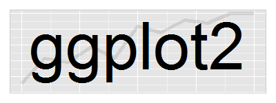

## Introdução


```{r transform, echo=FALSE, fig.cap='Lousa mágica Toy Story.'}

```


- Criado pelo Hadley Wickham
- Gramática dos gráficos (Leland Wilkinson) -> o que é um gráfico estatístico?


- Mapeamento dos dados a partir dos atributos estéticos (posição, cores, formas, tamanhos) de formas geométricas (pontos, linhas, barras)


## Por que utilizar o ggplot?


```{r transform, echo=FALSE, fig.cap='Gráficos no R base.'}

```


```{r transform, echo=FALSE, fig.cap='Gráficos com ggplot2.'}

```


- construção é intuitiva e organizada
- a estrutura é a mesma para todo tipo de gráfico
- os gráficos já são naturalmente mais bonitos


## Visualização (banco de dados IMDB)

Kaggle: site de desafio de análises de dados

https://www.kaggle.com/deepmatrix/imdb-5000-movie-dataset


## Instalar pacotes

```{r, eval=FALSE}
install.packages("ggplot2")
library(ggplot2)
library(magrittr)
library(dplyr)
library(forcats)
library(readr)
```

## Ler dados

```{r}
dados <- read_rds("inputs/dados_imdb.rds")
dados
```

## Gráfico de dispersão: arrecadação vs orçamento

```{r}
ggplot(data = dados) +
  geom_point(aes(x = budget, y = gross))
```

## Verificando valor estranho

```{r}

dados %>% 
  filter(budget > 2e+09) %>% 
  select(movie_title, title_year, country)

```

## Filtrando apenas para filmes norte-americanos

```{r}

dados %>% 
  filter(country == "USA") %>%
  ggplot +
  geom_point(aes(x = budget, y = gross))
  

```


## Mapeando a cor

```{r}
dados %>%
  filter(country == "USA") %>%
  mutate(ano_c = ifelse(title_year < 2000, "periodo1", "periodo2")) %>% 
  ggplot +
  geom_point(aes(x = budget, y = gross, color = ano_c))
```

## E se usarmos o ano como variável contínua?

```{r}
dados %>%
  filter(country == "USA") %>%
  ggplot +
  geom_point(aes(x = budget, y = gross, color = title_year))
```

## Acrescentando a reta y = x

```{r}
dados %>%
  filter(country == "USA") %>%
  ggplot +
  geom_point(aes(x = budget, y = gross, color = title_year)) +
  geom_abline(intercept = 0, slope = 1, color = "red")
```

## Mapeando a forma dos pontos

```{r}
dados %>%
  filter(country == "USA") %>%
  mutate(content_rating = content_rating %>% as.factor %>% 
           fct_collapse(Outros = c("Approved", "G", "GP", "M", "Not Rated",
                                   "Passed", "TV-14", "TV-G", "TV-MA", "TV-PG",
                                   "TV-Y7", "Unrated", "X"))) %>% 
  ggplot +
  geom_point(aes(x = budget, y = gross, color = title_year, shape = content_rating)) +
  geom_abline(intercept = 0, slope = 1)
```

## Reordenando os níveis da classificação

```{r}
dados %>%
  filter(country == "USA") %>%
  mutate(content_rating = content_rating %>% as.factor %>% 
           fct_collapse(Outros = c("Approved", "G", "GP", "M", "Not Rated",
                                   "Passed", "TV-14", "TV-G", "TV-MA", "TV-PG",
                                   "TV-Y7", "Unrated", "X")),
         content_rating = lvls_reorder(content_rating, c(3, 4, 5, 2, 1))) %>%
  
  ggplot +
  geom_point(aes(x = budget, y = gross, color = title_year, shape = content_rating)) +
  geom_abline(intercept = 0, slope = 1)
```

# Labels

```{r}
dados %>%
  filter(country == "USA") %>%
  mutate(content_rating = content_rating %>% as.factor %>% 
           fct_collapse(Outros = c("Approved", "G", "GP", "M", "Not Rated",
                                   "Passed", "TV-14", "TV-G", "TV-MA", "TV-PG",
                                   "TV-Y7", "Unrated", "X")),
         content_rating = lvls_reorder(content_rating, c(3, 4, 5, 2, 1))) %>%
  
  ggplot +
  geom_point(aes(x = budget, y = gross, color = title_year, shape = content_rating)) +
  geom_abline(intercept = 0, slope = 1) +
  labs(x = "Orçamento", y = "Arrecadação", color = "Ano de\nLançamento",
       shape = "Classificação")
```


## Boxplot: Arrecadações x diretores (7 com mais filmes)

```{r}
dados %>%
  filter(country == "USA") %>%
  count(director_name, sort = T)

dados %>% 
  filter(country == "USA", !is.na(director_name)) %>%
  group_by(director_name) %>% 
  filter(n() >= 15) %>% 
  ggplot +
  geom_boxplot(aes(x = as.factor(director_name), y = gross))
```

## Arrumando labels do eixo x


```{r}
dados %>% 
  filter(country == "USA", !is.na(director_name)) %>%
  group_by(director_name) %>% 
  filter(n() >= 15) %>% 
  ggplot +
  geom_boxplot(aes(x = as.factor(director_name), y = gross)) +
  theme(axis.text.x = element_text(angle=70, vjust = 0.5))
```


## Ordenando pela mediana

```{r}
dados %>% 
  filter(country == "USA", !is.na(director_name), !is.na(gross)) %>%
  group_by(director_name) %>% 
  filter(n() >= 15) %>%
  ungroup() %>% 
  mutate(director_name = director_name %>% as.factor %>%
           fct_reorder(gross, fun = median)) %>% 
  ggplot +
  geom_boxplot(aes(x = director_name, y = gross)) +
  theme(axis.text.x = element_text(angle=70, vjust = 0.5))
```

# Histograma: notas do Ridley Scott

```{r}
dados %>% 
  filter(country == "USA", director_name == "Ridley Scott") %>%  #
  unique() %>% 
  ggplot +
  geom_histogram(aes(x = imdb_score))
```

## Arrumando o número de classes


```{r}
dados %>% 
  filter(director_name == "Ridley Scott") %>%  #
  unique() %>% 
  ggplot +
  geom_histogram(aes(x = imdb_score), binwidth = 0.5)
```

## Mudando a cor

```{r}
dados %>% 
  filter(director_name == "Ridley Scott") %>%  #
  unique() %>% 
  ggplot +
  geom_histogram(aes(x = imdb_score), binwidth = 0.5, color = "white")
```

## Mudando a cor - Parte II

```{r}
dados %>% 
  filter(director_name == "Ridley Scott") %>%  #
  unique() %>% 
  ggplot +
  geom_histogram(aes(x = imdb_score), binwidth = 0.5, fill = "white", color = "black")
```

## Grid: notas do Tarantino, Scorsese e Tim Burton ao longo do tempo

```{r}
dados %>% 
  filter(director_name %in% c("Quentin Tarantino", "Martin Scorsese", "Tim Burton")) %>% 
  ggplot() +
  geom_point(aes(x = title_year, y = imdb_score)) +
  facet_grid(director_name~.)
```

## Ligando os pontos

```{r}
dados %>% 
  filter(director_name %in% c("Quentin Tarantino", "Martin Scorsese", "Tim Burton")) %>% 
  ggplot() +
  geom_point(aes(x = title_year, y = imdb_score)) +
  geom_line(aes(x = title_year, y = imdb_score)) +
  facet_grid(director_name~.)
```

## Escrevendo de outra forma

```{r}
dados %>% 
  filter(director_name %in% c("Quentin Tarantino", "Martin Scorsese", "Tim Burton")) %>% 
  ggplot(aes(x = title_year, y = imdb_score)) +
  geom_point() +
  geom_line() +
  facet_grid(director_name~.)
```

## Grafíco de barras: atores que aparecem em mais filmes

```{r}
dados %>%
  gather(key = "pos", value = "ator", actor_1_name) %>%
  filter(!is.na(ator)) %>% 
  group_by(ator, pos) %>%
  filter(n() >= 27) %>% 
  ggplot() +
  geom_bar(aes(x = ator))
```

## Deixando mais bonito

```{r}
dados %>%
  gather(key = "pos", value = "ator", actor_1_name:actor_3_name) %>%
  filter(!is.na(ator)) %>% 
  group_by(ator) %>%
  filter(n() >= 33) %>%
  ungroup %>% 
  mutate(ator = ator %>% as.factor %>% fct_reorder(ator, table)) %>% 
  ggplot() +
  geom_bar(aes(x = ator), fill = "dark green", color = "white") +
  theme(axis.text.x = element_text(angle = 90))
```


## Gráfico de barras: stat = "identity"

```{r}
dados %>%
  filter(actor_1_name == "Andrew Garfield" |
         actor_2_name == "Andrew Garfield" |
         actor_3_name == "Andrew Garfield",
         !is.na(gross)) %>% 
  ggplot() +
  geom_bar(aes(x = movie_title, y = gross), stat = "identity") +
  theme(axis.text.x = element_text(angle = 90))
```

## Deixando mais bonito

```{r}
dados %>%
  filter(actor_1_name == "Andrew Garfield" |
         actor_2_name == "Andrew Garfield" |
         actor_3_name == "Andrew Garfield",
         !is.na(gross)) %>%
  mutate(movie_title = movie_title %>% as.factor %>%
           fct_reorder(gross, median)) %>% 
  ggplot() +
  geom_bar(aes(x = movie_title, y = gross, fill = movie_title), stat = "identity",
           color = "black") +
  theme(axis.text.x = element_blank(), legend.position="bottom",
        legend.title = element_blank()) +
  ggtitle("Andrew Garfield, eu te odeio!")
  
```


## Exercícios

1 - Refaça o primeiro gráfico (arrecadação vs orçamento) colocando junto dos pontos uma curva alisada. Dica: geom_smooth().

2. Refazer o gráfico das notas do Tarantino, Scorsese e Tim Burton colocando as curvas no mesmo gráfico e as seprando pela cor. Dica: você vai precisar usar o argumento 'group='.

3. Faça um gráfico para visualizar as 10 maiores bilheterias de 2016.

4. Faça um gráfico para visualizar as notas dos filmes do seu ator ou diretor preferido. Se você não tiver um (ou se tiver poucas entradas no banco de dados), escolha uma opção a seguir:

- Steven Spielberg.
- Zack Snyder
- Robin Williams
- Hugh jackman
- Jennifer Lawrence
- Meryl Streep
