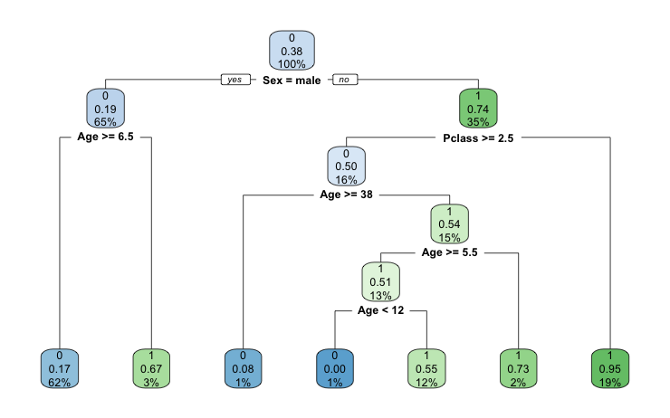
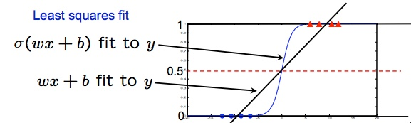

```{r setup, include=FALSE}
knitr::opts_chunk$set(echo = FALSE)
```

## O que é aprendizado estatístico?

## Tipos de aprendizado

- Supervisionado
 
Um estudo estatístico cujo objetivo é estimar a probabilidade de uma transação 
ser uma fraude e são fornecidos dados relativos a transações passadas bem como se 
estas foram uma fraude ou não. É considerado um estudo de aprendizado supervisionado. 
 
- Não Supervisionado

Um estudo em que são fornecidas diversas informações sobre os hábitos de compras
dos clientes e deseja-se identificar diferentes segmentos, é um
estudo de aprendizado não-supervisionado.

## Aprendizado Supervisionado

1. Definir o objetivo
2. Definir a variável resposta ($y$)
3. Definir as covariáveis que ajudam a prever a resposta ($X$)
4. Coletar dados
5. Ajustar/Treinar o modelo

## O que é treinar o modelo?

Estimar a função $f$ nesta equação:

$$y = f(X) + \epsilon$$
em que:

- $y$ é a variável resposta
- $X$ é uma matriz de covariáveis
- $\epsilon$ é um componente de aleatoriedade

## Como estimar $f$?

- Regressão linear
- Regressão logística
- Árvore de decisão
- Florestas Aleatórias
- Redes Neurais

## Regressão linear

Suposição de que $f(X)$ é da forma:

$$f(X) = \alpha + \beta X$$

Reduz o problema para: estimar $\alpha$ e $\beta$.

## Como estimar $\alpha$ e $\beta$?

$\alpha$ e $\beta$ são escolhidos de tal forma que:

$$\sum_{i = 1}^{n} [y_i - (\alpha + \beta x_i)]^2$$
seja o menor possível. Isto é, estamos minimizando o *erro quadrático*.

## Exemplo:

No R

## Arvore de decisao

- Cria regras do tipo se-então para aproximar uma função.


## Árvore de decisão

```{r, echo=FALSE, message=FALSE, warning=FALSE}
library(dplyr)
library(ggplot2)
base <- purrr::map_df(c(0, 2), ~data.frame(color = .x, x = rnorm(100, .x)))
base <- base %>% mutate(cor = ifelse(color <= 0, 'azul', 'laranja'))
ggplot(base, aes(x = x, fill = cor)) + 
  geom_histogram(position = 'dodge', bins = 20) +
  scale_fill_manual(values = c('azul' = 'blue', 'laranja' = 'orange'))
```

##



## Exemplo 

No R

## Overfitting

- Deve ser uma das principais preocupações quando ajustamos um modelo

## O que é overfitting?

O modelo está ajustando variações que são inerentemente aleatórias dos dados.

## Exemplo

No R

## Como evitar overfitting?

- Será que o meu modelo está muito complexo? 
- Princípio da Navalha de Ocam ou Lei da parcimônia

Na prática:

- Separar a base em 2 partes: treino e teste e avaliar o erro na base de teste
- Cross-validation

## Regressão logística

É um modelo linear em X. A suposição é de que:

$$y = \frac{1}{1 + e^{-f(X) + \epsilon}}$$
Em que $f(X)$ é uma função da forma $f(X) = \alpha + \beta X$

Porque?

- Fácil de interpretar: os coeficientes do modelo relacionam-se à chance do evento acontecer
- A relação linear não precisa de cair em um intervalo ex. [0,1]
- A deriavada é fácil de ser calculada 

## Por que R a função logística?



## Como estimar $\alpha$ e $\beta$?

Os parâmetros são estimados de forma que minimize o erro de classificação:

$$\sum_{i=1}^{n} (y_i - \frac{1}{1 + e^{-f(X_i)}})$$

## Exemplo

No R